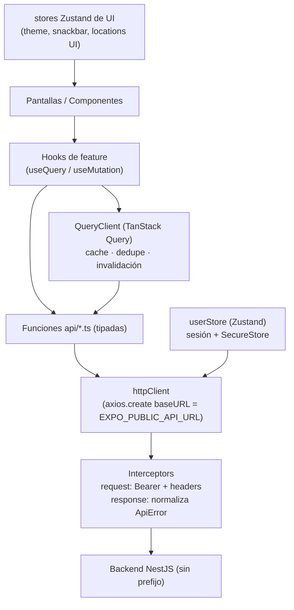

# Arquitectura de Integración — App Móvil ↔ Backend Listify

> Estado: borrador para revisión. Define la capa de datos de la app móvil (`listify`) y su contrato con el backend (`listify-backend`). Las decisiones puntuales están en [`../adr`](../adr/README.md).

## 1. Contexto

La app móvil (Expo SDK 54 / RN 0.81 / Expo Router 6) ya consume el backend real (NestJS 11 + Prisma + Postgres/PostGIS + Redis, sesiones opacas tipo Bearer). La integración **base ya funciona** (auth y productos). Este documento consolida la capa de datos, fija convenciones y traza el roadmap para extender la cobertura al resto de recursos.

> **Nota de método:** el diagnóstico de abajo fue verificado leyendo los controllers/servicios del backend, no solo exploración automática. Lo que está marcado como "correcto" se comprobó contra el código.

## 2. Diagnóstico verificado

### Ya correcto (no tocar)
- **Sin prefijo global:** `main.ts` del backend **no** llama `setGlobalPrefix`; los controllers viven en `/auth`, `/products`, `/users`, … La app con `${EXPO_PUBLIC_API_URL}/<recurso>` es correcta. (Deuda intencional documentada en `listify-backend/docs/adr/0011`).
- **Auth:** `POST /auth/login`, `GET /auth/whoami`, `POST /auth/logout` y los `*-password-code` coinciden con `api/auth.api.ts`. Login/whoami devuelven `{ token, expiresAt, user }` (el `user` incluye `profile`).
- **Productos:** `GET /products/ean/:ean`, `GET /products/ean-light/:ean` y `POST /products/ean/:ean/nearby-prices` coinciden con `api/products.api.ts`.
- **createLocation:** funciona — `ValidationPipe({ whitelist:true })` descarta el `userId` extra que envía la app; el resto del body coincide con `CreateLocationDto`.

### Desajustes reales a corregir (en Fase 1+)
| # | Desajuste | Evidencia | Real esperado |
|---|-----------|-----------|---------------|
| 1 | Código muerto a endpoint inexistente | `api/products.api.ts:34` → `POST /products/brach-prices` | `GET /products/ean/:ean/prices` (y no se usa hoy) |
| 2 | Forma de respuesta paginada | `api/user.api.ts:42` espera `Location[]`, manda `?userId=` | `GET /users/list-locations` → `{ data, meta }`, user de sesión |
| 3 | Drift de tipos | `types/users.d.ts` `isVerifyed`/`fullname`/`biography` | `isVerified`/`fullName`/`bio` |
| 4 | `SigninResponse` ignora `expiresAt` | `api/types/auth-api.d.ts` | `{ token, expiresAt, user }` |

### Mejoras arquitectónicas (no son bugs)
- Axios global mutado en `utils/interceptor.ts` → instancia dedicada (ADR-0001).
- Fetching ad-hoc con `useEffect`, sin caché/dedupe/invalidación → TanStack Query (ADR-0002).

### Bloqueo conocido
- Tab "Recetas" sin backend: no existe módulo `recipes` (ADR-0007 + [`recipes-module-spec.md`](./recipes-module-spec.md)).

## 3. Arquitectura objetivo de la capa de datos

### Principios
1. **Separación de responsabilidades:** TanStack Query = estado de servidor (caché); Zustand = sesión + estado de UI.
2. **Un solo cliente HTTP** con `baseURL = EXPO_PUBLIC_API_URL`; las `*.api.ts` usan rutas **relativas**.
3. **Tipos como fuente de verdad** derivados del contrato real del backend (camelCase correcto, envoltorio paginado).
4. **Errores normalizados** en el interceptor de respuesta → forma estable (`ApiError`) para UI/snackbar y TanStack Query.

## 4. Contrato del backend (referencia)

- **Base URL:** `EXPO_PUBLIC_API_URL` (sin prefijo). Dev: `http://192.168.1.28:3000`.
- **Headers:** `Authorization: Bearer <token>`, `Content-Type: application/json`, `Accept-Language`, `Platform: mobile`.
- **Auth:** `POST /auth/login {email,password}` → `{ token, expiresAt, user }`; `GET /auth/whoami`; `POST /auth/logout`; `POST /auth/send-password-code`; `POST /auth/resend-password-code`; `POST /auth/verify-password-code`; `PATCH /auth/change-pass`.
- **Users:** `POST /users/register`; `POST /users/verify {email,code}`; `POST /users/resend-code`; `GET /users/list-locations` (paginado, user de sesión); `POST /users/create-location {name,address?,latitude,longitude}`; `POST/DELETE /users/me/devices` (FCM); `*/users/me/payment-methods`.
- **Products:** `GET /products/ean/:ean`; `GET /products/ean-light/:ean`; `GET /products/ean/:ean/prices`; `POST /products/ean/:ean/nearby-prices`. Query comunes: `channel`, `currency`, `exchangeType`, `page`, `pageSize`.
- **Otros recursos disponibles:** `stores`, `shopping-lists` (+ items / collaborators / `optimize`), `price-alerts`, `price-history`, `payment-methods`, `discounts`, `exchange-rates`.
- **Errores (NestJS):** `{ statusCode, message, error }`; `message` puede ser `string` o `string[]` (validación class-validator).
- **Paginación:** `{ data: T[], meta: { total, page, pageSize, pages } }`.

## 5. Convenciones de la capa de datos

- **Rutas:** relativas al `baseURL` (`/products/ean/${ean}`), nunca absolutas.
- **Tipos:** `api/types/` refleja el contrato real (camelCase). Genérico `Paginated<T> = { data: T[]; meta: { total: number; page: number; pageSize: number; pages: number } }`.
- **Errores:** el interceptor mapea la respuesta de error a `ApiError { statusCode, message, raw }` (ver ADR-0005); el snackbar global se conserva.
- **Query keys (TanStack Query):** tuplas namespaced por recurso, p. ej. `['product', ean, { channel, currency }]`, `['locations', { page }]`, `['shopping-lists']`. Invalidación por prefijo de recurso tras mutaciones.
- **Sesión:** token en `expo-secure-store` (`sessionToken`); inyección por interceptor; rehidratación con `whoami`; `401` → cierre de sesión (ADR-0003).

## 6. Roadmap por fases

| Fase | Alcance | Estado |
|------|---------|--------|
| 0 | Documentación: arquitectura + ADRs 0001–0007 + spec de Recetas | **En revisión** |
| 1 | Fundación/infra: `httpClient`, TanStack Query, tipos, contrato de auth | **Hecha** (verificada en runtime) |
| 2 | Productos / escaneo / mapa (incluye retirar `brach-prices`, migrar hooks a `useQuery`) | **Hecha** (código; pendiente verificación runtime) |
| 3 | Listas de compras (+ optimizador) | Pendiente |
| 4 | Ubicaciones paginadas, pagos/descuentos, alertas, cotizaciones, push (FCM) | Pendiente |
| 5 | Recetas (bloqueada por backend) | Bloqueada |

## 7. Mapa de migración de `api/`

- `utils/interceptor.ts` → `utils/httpClient.ts` (instancia dedicada).
- `api/auth.api.ts`, `api/user.api.ts`, `api/products.api.ts` → rutas relativas, importan `@/utils/httpClient`.
- `types/users.d.ts` + `api/types/*.d.ts` → camelCase real + `Paginated<T>` + `ApiError`.
- Nuevos: `utils/queryClient.ts`, `app/_layout.tsx` con `QueryClientProvider`.
- Por recurso nuevo (Fases 3–4): un `api/<recurso>.api.ts` + tipos + hooks `useQuery/useMutation`.
